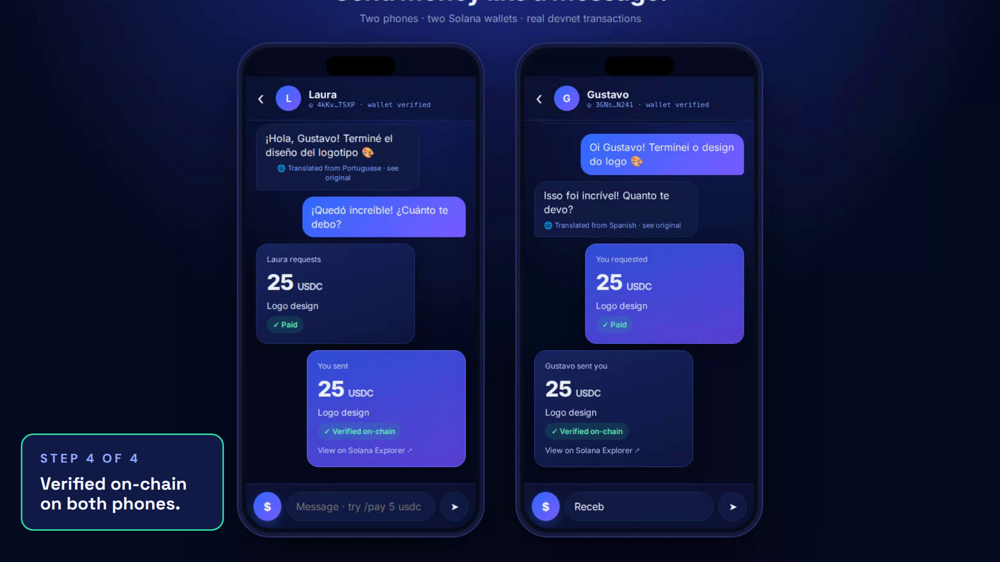

<p align="center"></p>

# Chaski: send money like a message

Pay and request USDC inside a chat, in any language. Every user is a Solana wallet, and the receiver verifies every payment on-chain.



Built for the Superteam Argentina **Road to Colosseum** hackathon (Oct 2026).

## How it works

1. **The wallet is the identity.** At sign-up the app creates a Solana keypair on the device. The public key is the user's ID. No seed phrase is shown.
2. **Every message is signed.** Each chat message is ed25519-signed by the sender's wallet. The relay ([`server/relay.mjs`](server/relay.mjs)) rejects any envelope whose signature does not match the claimed sender, and it never touches funds.
3. **Payments are transactions with a memo.** Paying or requesting (`$` button or `/pay 25 usdc`, `/request 25 usdc`) sends an SPL `TransferChecked` (or a SOL transfer) plus an SPL Memo `chaski:<messageId>`. One transaction maps to exactly one chat message, so a signature cannot be replayed into another message.
4. **The receiver checks the chain, not the chat.** [`verifyTransfer`](src/solana.ts) fetches the parsed transaction and checks the sender, the recipient token account, the mint, the exact amount and the memo before the UI shows **Verified on-chain**.
5. **Translation is a view.** Incoming messages are shown in the reader's language; the signed original is one tap away.
6. **A transfer guard adds friction where it matters** ([`src/guard.ts`](src/guard.ts)): the first payment to a contact and large amounts ask for confirmation, and paying a request you received goes straight through.

## Evidence (Solana devnet)

| What | Result |
|---|---|
| End-to-end demo payment, 25 USDC (test mint) | [`4Et2ci…KZyiY`](https://explorer.solana.com/tx/4Et2ciFUpqimzfii5aNoR3j69g5eSeCG2J1uBaKUsx6hTXyfyp68nCjcwU2q4YBtUVBQC4C294KDtFhGU8KZyiY?cluster=devnet): Finalized, memo `chaski:344cb7b4-69d` |
| Send to confirmed latency | median 0.97 s, range 0.9 to 1.8 s (5 transfers, public devnet RPC, 2026-10-03) |
| Same flow after the security hardening (nonce login, priority fee) | [`3trTim…R96gT`](https://explorer.solana.com/tx/3trTimQZ5gdNQ77uL9C4WRL4t32kEvFquWCsikuyG7Z66rARjxbaaQZdJn4sxHY5annbUWcr8Mp3xadT1HiR96gT?cluster=devnet): fee 0.00000508 SOL, 13,132 CU |
| Attacks on the relay | covered by `npm test` (see below) |

## Run it

Requires Node 22.18+ (24 recommended; tests run TypeScript natively) and the Solana CLI with a funded devnet keypair at `~/.config/solana/id.json`.

```bash
npm install
npm run setup:devnet   # one-time: creates a faucet wallet (3 SOL from your CLI key) and a 6-decimal test "USDC" mint
npm run dev            # relay on :8787 + web on :5173
```

- Two users in one browser: `http://localhost:5173/?u=gustavo` and `http://localhost:5173/?u=laura`
- Both phones on one screen: `http://localhost:5173/?split=gustavo,laura`
- Scripted demo with fresh wallets and real transactions: `http://localhost:5173/?split=gustavo,laura&autoplay`

## Mainnet

The same build runs on mainnet. The relay picks the network and hands it to clients through `/config`:

```bash
CLUSTER=mainnet-beta RPC_URL=https://<private-rpc> CLIENT_RPC_URL=https://<public-rpc> npm run relay   # Circle USDC (EPjF…Dt1v), no faucet
```

On mainnet the faucet is off (`/faucet` returns 404), Explorer links drop `?cluster=devnet`, and every transfer carries a compute-unit limit plus a priority fee (`PRIORITY_MICROLAMPORTS`, default 20,000). Users fund their own wallet with USDC and a little SOL for fees. `RPC_URL` stays on the server; `CLIENT_RPC_URL` is handed to browsers, so use a public, domain-restricted key there. Variables can go in `.env` (see `.env.example`); the relay loads it.

## Tests

```bash
npm test
```

15 tests, no extra dependencies (`node --test`, Node 24 runs TypeScript directly). CI runs typecheck, tests and build on every push and pull request.

- **Payment verification** against a real devnet transaction stored in `tests/fixtures/`: the genuine payment passes. A failed tx fails, and so do another message id (replay), a different amount, recipient, sender or mint, and a stripped memo.
- **Relay authentication**: a hello signed with another key is rejected, a captured hello replayed on a new connection is rejected, and the same signed message is accepted once.
- **Transfer guard** policy and exact decimal parsing.

## Security model

- Login is challenge-response: the relay sends a one-time nonce per connection and the client signs `{ t: 'chaski-relay-auth', nonce, profile }`.
- Every message is signed by its sender. The relay drops duplicate message ids and duplicate transaction signatures.
- A request shows **Paid** only after a transfer for it verified on-chain, from the person who was asked, for the same amount and token.
- Deep links (`?chat=`) take a public key. A display name is accepted only when exactly one contact uses it.
- `/faucet` (3 per hour) and `/translate` (60 per minute) are rate-limited per IP; chat messages are limited to 30 per minute per wallet, frames to 16 KB, and malformed messages are rejected.
- Clients re-check every message signature themselves, so they don't have to trust the relay.
- Transfers are signed before sending and the card is posted with the signature, so a payment can't be lost or front-run; a confirmation timeout is checked against the chain before it counts as failed.

## Stack

Solana devnet · `@solana/web3.js` · SPL Token (`TransferChecked`, associated token accounts) · SPL Memo · ed25519 (`tweetnacl`) · React + TypeScript + Vite · Node.js WebSocket relay · MyMemory translation API

## MVP today, production next

| Today (this repo) | Next |
|---|---|
| Test-USDC mint on devnet | Real USDC on mainnet |
| Keypair stored in the browser | Passkey / MPC embedded wallet |
| In-memory relay | Persistent relay with encrypted message storage |
| MyMemory translation API | Higher-quality translation model |
| No off-ramp | One local off-ramp partner (Argentina ↔ Brazil corridor first) |

Known limits: messages are signed but not end-to-end encrypted yet. The relay keeps state in memory and loses it on restart. Users need SOL for fees, and fee sponsorship is on the roadmap. The "pay me" link that works without an account is not built yet.

## Team

Gustavo Meza, creator and CEO of Chaski.
